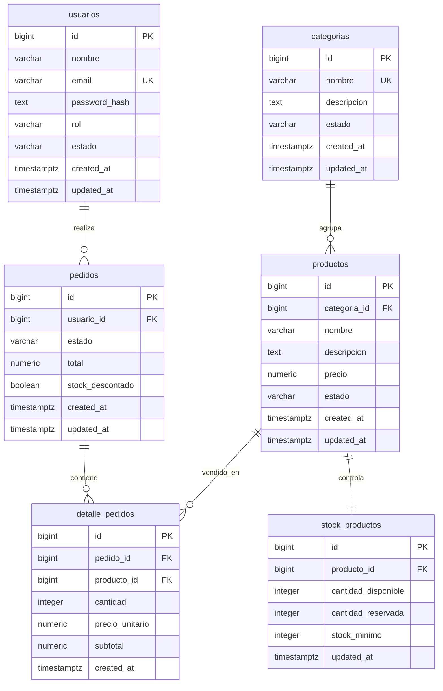

# Diagrama ER

```mermaid
erDiagram
    usuarios ||--o{ pedidos : realiza
    categorias ||--o{ productos : agrupa
    productos ||--|| stock_productos : controla
    pedidos ||--o{ detalle_pedidos : contiene
    productos ||--o{ detalle_pedidos : vendido_en

    usuarios {
        bigint id PK
        varchar nombre
        varchar email UK
        text password_hash
        varchar rol
        varchar estado
        timestamptz created_at
        timestamptz updated_at
    }

    categorias {
        bigint id PK
        varchar nombre UK
        text descripcion
        varchar estado
        timestamptz created_at
        timestamptz updated_at
    }

    productos {
        bigint id PK
        bigint categoria_id FK
        varchar nombre
        text descripcion
        numeric precio
        varchar estado
        timestamptz created_at
        timestamptz updated_at
    }

    stock_productos {
        bigint id PK
        bigint producto_id FK
        integer cantidad_disponible
        integer cantidad_reservada
        integer stock_minimo
        timestamptz updated_at
    }

    pedidos {
        bigint id PK
        bigint usuario_id FK
        varchar estado
        numeric total
        boolean stock_descontado
        timestamptz created_at
        timestamptz updated_at
    }

    detalle_pedidos {
        bigint id PK
        bigint pedido_id FK
        bigint producto_id FK
        integer cantidad
        numeric precio_unitario
        numeric subtotal
        timestamptz created_at
    }
```
